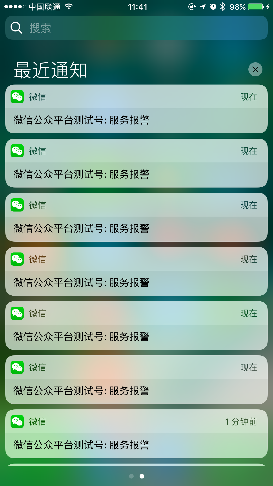
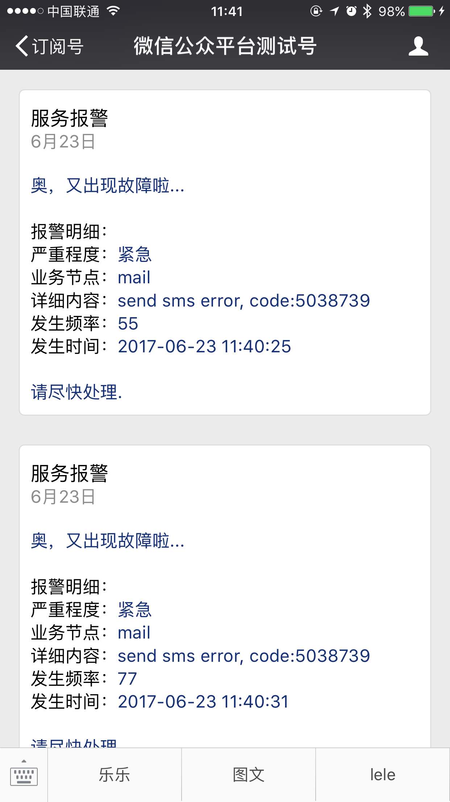

## 关于监控通知系统

本系统基于 Laravel 5.4 开发，实现系统报警通知。本系统初期选用微信公众号模板消息做为通知源，后期会加入短信和邮件，微信相对于传统方式短信和邮件会更方便，及时，免费。

该项目更多的只是示例，生产环境使用的话，还需要自己去动手开发。

## 部署
```php
php artisan migrate
```

## 配置
.env 加入微信相关配置
```php
WECHAT_APPID
WECHAT_SECRET
WECHAT_TOKEN
WECHAT_AES_KEY
WECHAT_LOG_LEVEL
```

## 获取接收人openid
关注微信公众号，拿到openid
> 我这里用的是微信测试公众号。

## 添加模板消息
```php
{{ first.DATA }} 

告警明细： 
严重程度：{{ level.DATA }} 
业务节点：{{ node.DATA }} 
详细内容：{{ content.DATA }} 
发生频率：{{ frequency.DATA }} 
发生时间：{{ date.DATA }} 

{{ remark.DATA }}
```
> 添加完成后可以得到模板消息ID

## 修改 WechatController 控制器 message 方法
```php
    public function message(Application $wechat){
        $notice = $wechat->notice;

        $result = $notice->send([
            'touser' => 'oKZ5et5tJ_yaY48ZOGzFOn8wdmyg',
            'template_id' => '8e8-34744kDGjhxRyGDZHnmYkl574kfqtA1NXvMZXW0',
            'data' => [
                "first" => "奥，又出现故障啦...",
                "level" => '紧急',
                "node" => 'sms',
                "content" => 'send sms error, code:5038739',
                "frequency" => '998',
                "date" => date("Y-m-d H:i:s"),
                "remark" => '请尽快处理.',
            ],
        ]);

        return $result;
    }
```

 这里用的是 overtrue/laravel-wechat 包可以。用法可以参考
- Github: https://github.com/overtrue/laravel-wechat
- 文档地址：https://easywechat.org/

## 预览
<p align="center"></p>
<p align="center"></p>

> 由于时间比较仓促，说明文档写的比较简陋，可能会有一些坑。后面会抽时间完善。

